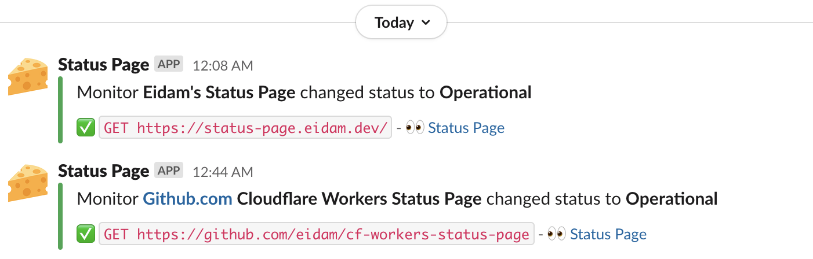

# Cloudflare Worker - Status Page

Monitor your websites, showcase status including daily history, and get Slack notification whenever your website status changes. Using **Cloudflare Workers**, **CRON Triggers,** and **KV storage**. Check [my status page](https://status-page.eidam.dev) out! 🚀




## Pre-requisites

You'll need a [Cloudflare Workers account](https://dash.cloudflare.com/sign-up/workers) with

* A workers domain set up
* The Workers Bundled subscription \($5/mo\)
* Some websites/APIs to watch 🙂

Also, prepare the following secrets

* Cloudflare API token with `Edit Cloudflare Workers` permissions
* Slack incoming webhook \(optional\)

## Getting started

You can either deploy with **Cloudflare Deploy Button** using GitHub Actions or deploy on your own.

### Deploy with Cloudflare Deploy Button

[](https://deploy.workers.cloudflare.com/?url=https://github.com/eidam/cf-workers-status-page&paid=true)

1. Click the button and follow the instructions, you should end up with a clone of this repository
2. Navigate to your new **GitHub repository &gt; Settings &gt; Secrets** and add the following secrets:

   ```yaml
   - Name: CF_API_TOKEN (should be added automatically)

   - Name: CF_ACCOUNT_ID (should be added automatically)

   - Name: SECRET_SLACK_WEBHOOK_URL (optional)
   - Value: your-slack-webhook-url
   ```
3. Navigate to the **Actions** settings in your repository and enable them
4. Edit [config.yaml](https://github.com/eidam/cf-workers-status-page/blob/main/config.yaml) to adjust configuration and list all of your websites/APIs you want to monitor

   ```yaml
   settings:
     title: "Status Page"
     url: "https://status-page.eidam.dev" # used for Slack messages
     logo: logo-192x192.png # image in ./public/ folder
     daysInHistogram: 90 # number of days you want to display in histogram

     # configurable texts across the status page
     allmonitorsOperational: "All Systems Operational"
     notAllmonitorsOperational: "Not All Systems Operational"
     monitorLabelOperational: "Operational"
     monitorLabelNotOperational: "Not Operational"
     monitorLabelNoData: "No data"
     dayInHistogramNoData: "No data"
     dayInHistogramOperational: "All good"
     dayInHistogramNotOperational: "Some checks failed"

   # list of monitors
   monitors:
     - id: status-page-eidam-dev # unique identifier
       name: Eidam's Status Page
       description: 'https://status-page.eidam.dev' # default=empty
       url: 'https://status-page.eidam.dev/' # URL to fetch
       method: GET # default=GET
       expectStatus: 200 # operational status, default=200
       followRedirect: false # should fetch follow redirects, default=false
   ```

5. Push to `main` branch to trigger the deployment
6. 🎉
7. _\(optional\)_ Go to [Cloudflare Workers settings](https://dash.cloudflare.com/?to=/workers) and assign custom domain/route
   * e.g. `status-page.eidam.dev/*` _\(make sure you include `/*` as the Worker also serve static files\)_
8. _\(optional\)_ Edit [wrangler.toml](https://github.com/eidam/cf-workers-github-releases/blob/main/wrangler.toml) to adjust Worker settings or CRON Trigger schedule

### Deploy on your own

You can clone the repository yourself and use Wrangler CLI to develop/deploy, extra list of things you need to take care of:

* create KV namespace and add the `KV_STATUS_PAGE` binding to [wrangler.toml](https://github.com/eidam/cf-workers-github-releases/blob/main/wrangler.toml)
* create Worker secrets _\(optional\)_
  * `SECRET_SLACK_WEBHOOK_URL`

## Known issues

* **Max 25 monitors to watch in case you are using Slack notifications**, due to the limit of subrequests Cloudflare Worker can make \(50\).

  The plan is to support up to 49 by sending only one Slack notification per scheduled run.

* **KV replication lag** - You might get Slack notification instantly, however it may take couple of more seconds to see the change on your status page as [Cron Triggers are usually running on underutilized quiet hours machines](https://blog.cloudflare.com/introducing-cron-triggers-for-cloudflare-workers/#how-are-you-able-to-offer-this-feature-at-no-additional-cost).

* **Initial delay (no data)** - It takes couple of minutes to schedule and run CRON Triggers for the first time